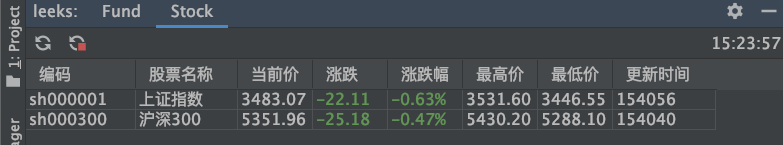
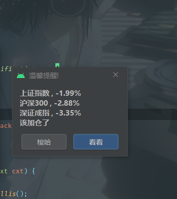

### 0. 背景

> 原插件地址： https://github.com/huage2580/leeks 
> 感谢大佬开源的插件

某天在技术交流群里发现一款AS插件，它的名字叫leeks，感觉有点意思



于是，我就想，要不在这个插件的基础上简单改改，每个交易日下午赌场要关门的时候根据行情提醒一下我，该加仓了。如果行情不好，则不用提醒我。

于是开始搞，最后，差不多是这个样子~



### 1. 插件开发环境准备

1. 下载`IntelliJ IDEA 2019.3.5 (Community Edition)`,选择社区版,因为开源的.方面后面看源码.
2. NewProject->Gradle->勾选Java和IntelliJ Platform Plugin->输入项目名称->finish
3. 在build.gradle中修改IntelliJ,把version注释掉,免得它去下载几百M的sdk,慢的很

```java
intellij {
    //version '2019.3.5'
    //直接用本地的  不用下载
    localPath = "D:\\install\\ideaIC-2019.3.5.win"
    
    //mac 用这个路径
    //localPath = "/Applications/IntelliJ IDEA CE.app"
}
```
4. 然后Build Project,然后就可以运行了

### 2. clone已有项目

1. 用idea打开之后，先下载好gradle。mac目录是`/Users/用户名/.gradle/wrapper/dists`。
2. 然后等idea下载各种依赖，如果下载比较慢，则把全局代理开启，可能会快些
3. Add Configurations ： 先选择Gradle，然后Gradle projects那里选择当前项目的目录，然后下面的Tasks那里填写`:runIde`，点击OK。
4. 然后就可以运行了

### 3. 下面是leeks的测试数据

160225,162605,519732,161005,163402,166002,519736

sh000001,sh000300

XConstant里面的`IS_DEBUG`可以控制是否为debug模式。